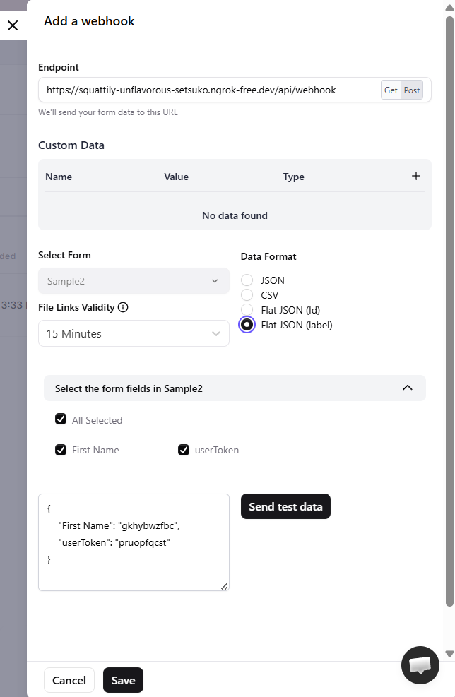

# Integrating forms into your Web Application

The goal of this example is to enable you to create a form for users. When a user submits a form, the form submission needs to be linked to a user's identity and securely stored in User Info. The code provides all the code necessary, but the steps below will explain where to get all the necessary requirements (i.e. environment variables and client secrets).

## Design your form

The standard form builder to be used is [sportszone](https://sportzoneforms.com/). However, as of this writing (02-APR-2026) sportzone doesn't provide a way to include a user's identity in the form submission. That feature is set to be released at a later time.

For the purposes of demonstrating how to identity and store a user's form submission, I recommend using [makeforms](https://makeforms.io/). The process of extracting submission data is identical between sportzone and makeforms.

### Inserting User Token into the form

As part of building the form, add a new input field.  
Give it the name **userToken**. Mark the field as hidden. Ensure that the field can contain at least 128 characters.  
On the side panel, on the right, click **Advanced Settings**  
Enable the "Auto fill from query parameter"  
Give the parameter name **userToken**

When sportzone enables passing in userId to forms, the instructions to do so will be here.

### Get iframe code to embed

Go to makeforms.io -> Forms -> Create new form  
Once the form is ready, click publish. Then go to sources.  
Click on the tile that says "Embed your form"
Give your widget a name.  
In the widget creation screen, select the Widget Type of **IFrame Embed**

If you are using Sportzone, once you hit Publish form, there is an option to get the link to embed the form. Look for JavaScript / Embed toggle. Select Embed toggle.

The code to embed should look similar to the follows:

```
<iframe src="https://ca.makeforms.co/xx7nkai" style="width: 100%;height: 500px;max-height: 100%;max-width: 100%;" frameborder="none"></iframe>
```

The full example of passing in the userToken to the form can be found [here]()

## Sign the user's id

To sign the user's id, a new endpoint needs to be created.
In this example, we add this route to the backend/src/routes.ts file

```
routes.get('/signUserToken', auth.authenticate, sampleController.signUserId)
```

When authenticated, the endpoint should return a jwt token that contains the userId.

The following code in SampleController can be used as an example of how to create a token from a userId

```javascript
  signUserId(req: Request, res: Response) {
    const userId = res.locals.user.sub // user object is added to request in the Auth middleware
    const signedUserId = jwt.sign({ userId },
                                  SAMPLE_SECRET,
                                  { expiresIn: '1h' })
    res.send({ userIdToken: signedUserId })
  }
```

The primary reason to generate a jwt token with the userId is to limit the ability of the third party provider from attempting to use the jwt token to get other user information. The token returned from /signUserToken won't work on any other endpoints. In the event that a forms provider becomes compromised, this token wont be able to be used to query for a user's personal information.

Once this token has been generated, the embeded iframe can be updated to be as follows:

```
<iframe :src="`https://ca.makeforms.co/xx7nkai?userToken=${yourUserIdToken}`" style="width: 100%;height: 500px;max-height: 100%;max-width: 100%;" frameborder="none"></iframe>
```

The full code is [here]()

## Create an endpoint for a webhook

Both Sportzone and MakeForms use wehbooks to send a user's form submission.
Another reason that userId should be encrypted is because webhooks are not accepting the level of security that CFL is using via Keycloak.  
By verifying that the userId in the form is a real user, your endpoint will accept only submissions that come from logged in users.

In this example, lets create a WebhookController

```
import type { Request, Response } from 'express'

export class WebhookController {

  receiveWebhookData = async (req: Request, res: Response) => {
    console.log('Form Submission ', req.body)
  }
}

const webhookController = new WebhookController()

export { webhookController }

```

And then we will add it to the backend/src/routes.ts file

```
routes.post('/webhook', webhookController.receiveWebhookData)
```

#### Dev Environment only

To test out your webhook API, you will need to expose it over the internet.

One tool to use is [**ngrok**](https://dashboard.ngrok.com/signup)

You'll need an auth token to start it.

```
ngrok config add-authtoken <insert your token here>
```

For this example, the backend runs on port **3001**,

To expose your running endpoint,

```bash
ngrok http 3001
```

The command will give you a url that you can use, that is similar to this:

```
 https://squattily-unflavorous-setsuko.ngrok-free.dev
```

You will use this URL when configuring your webhook in your Forms Builder.

## Add your webhook to Sportzone

Or Makeforms. The process is the same:

Find Integrations tab within your Form in Sportzone
In MakeForms, add new webhook



I recommend selecting Flat JSON label, it will make it easier to format data for User Info later. Click Save.

## Ensure your Vue / Nuxt component passes in userToken correctly.

The code below shows how to pass in the encrypted user id into the form that you embed earlier.

Note that the token needs to be url encoded, since it will be included in query parameters. You will need to decode it prior to verifying the jwt token in your Webhook Controller.

```javascript
<script setup lang="ts">
    import { ref } from "vue"
    import apiClient from "../services/api"

    const userToken = ref()

    const formsURL = ref()
    try {
    const response = await apiClient.get("api/signUserToken")
    userToken.value = response.data.userIdToken
    const encodedUserToken = encodeURI(userToken.value)
    formsURL.value = `https://ca.makeforms.co/xx7nkai/?userToken=$  {encodedUserToken}`
    } catch (err: any) {
        console.log("Error in example ", err)
    }
</script>

<template>
  <template v-if="formsURL">
    <iframe
      :src="formsURL"
      style="width: 100%;height: 500px;max-height: 100%;max-width: 100%;"
      frameborder="none"
    ></iframe>
  </template>
</template>
```

To test out the form displays correctly, this example shows the form page under the /forms url

## Implement your Webhook Controller

The following function can help you extract the userId from the form submission
Please note that MakeForms and Sportzone sends the data in different formats, and it is your job extract to user id from the request body. The webhooks show examples of what the message format looks like to help you. The example shown below is based on MakeForms, with JSON Flat (label) option set.

```typescript
receiveWebhookData = async (req: Request, res: Response) => {
  const SAMPLE_SECRET = "SECRET_FOR_FORMS_REPLACE_IN_REAL_APP"

  let formData = req.body.data
  const decodedUserToken = decodeURI(formData.userToken)

  const tokenData = jwt.verify(decodedUserToken, SAMPLE_SECRET) as JwtPayload

  delete formData.userToken

  const userId = tokenData.userId
}
```

## Save data to User Info

The last step in this process is to save the user submission to user info.

To do this, you need to have a confidential client called sportzone_forms and the client secret. Post on the apex-sso channel on slack to get the secret.

Make sure your app has the following variable set in your .env file.

```bash
USER_INFO_URL=http://localhost:9300 // if local, https://api.id.dev.s.cfl.ca if dev
SPORTZONE_FORMS_CLIENT_SECRET=<GET_THIS_SECRET_FROM_ADMIN>
```

As with previous examples, your app also needs to successfully connect to keycloak.

If you are running keycloak locally set the keycloak variables as follows:

```
KEYCLOAK_URL=http://localhost:8350
KEYCLOAK_REALM=cfl
KEYCLOAK_CLIENT_ID=sample-admin  // use your client name here instead
```

If you are using the dev environment keycloak, set the variables as follows:

```
KEYCLOAK_URL=https://id.dev.s.cfl.ca
KEYCLOAK_REALM=cfl
KEYCLOAK_CLIENT_ID=sample-admin // use your client name here instead
```

## Generate token

In UserInfoService file, the following snippet generates the token that can be used to make the POST request to submit the form data on the user's behalf.

The full code example can be found [here]()

```typescript
const response = await axios.post(
  `${process.env.KEYCLOAK_URL}/realms/${process.env.KEYCLOAK_REALM}/protocol/openid-connect/token`,
  new URLSearchParams({
    grant_type: "client_credentials",
    client_id: SPORTZONE_CLIENT_ID,
    client_secret: process.env.SPORTZONE_FORMS_CLIENT_SECRET
  }),
  {
    headers: {
      "Content-Type": "application/x-www-form-urlencoded"
    }
  }
)
const data = response.data
return data.access_token
```

To call the endpoint, the following snippet shows an example code of submitting form data.

```typescript
  async saveToUserInfo(userId: string, campaignData: any) {
    const userDataToSubmit = <CampaignType>{
      userId,
      campaignId: 'Sample Campaign',
      data: campaignData,
    }

    const authToken = await this.generateAuthToken()
    const apiOptions = {
      headers: {
        'Content-Type': 'application/json',
        Authorization: `Bearer ${authToken}`,
      },
    }
    await axios.post(`${process.env.USER_INFO_URL}/api/v1/campaigns`, userDataToSubmit, apiOptions)
  }
```
